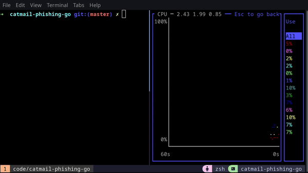
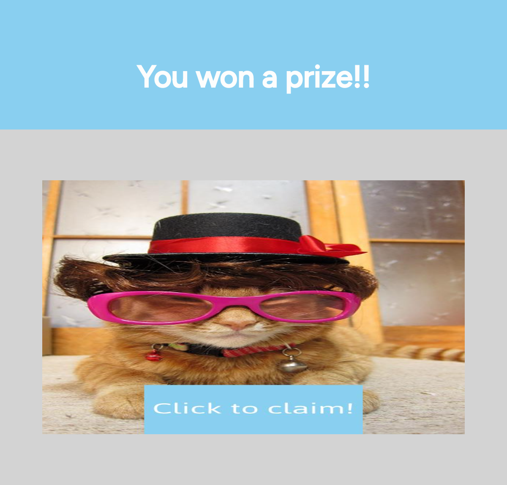
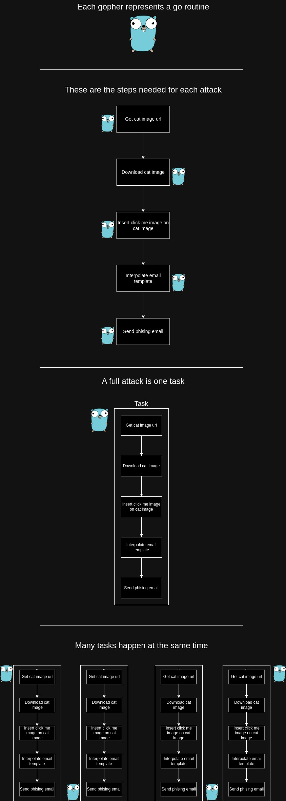
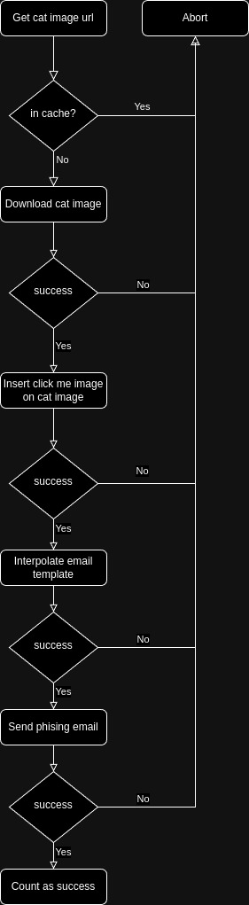

<div align="center">

# Catmail Phishing Go

Phishing attack proof of concept in go


<p align="center">

</p>

### Wouldn't you click?

<p>

</p>

> email example

</div>

## 🦩 **Why?**

The main reason here is to learn about golang.

The project was suggested by [Pedro Ramos](https://github.com/phramos07) as a way to increase golang skills, focusing in parallelism through routines.

## **🚀 About**

### Overall:

The project idea is to send a cute cat phishing scam email. In order to achieve this we need to download a cat image from the internet, then add a click to claim text, then put that image in a email template and then send it.

### Routines:

<p>

</p>

### Flow:

<p>

</p>

</br>
</br>

## **☕ Usage**

```sh
# go required
go run cat.go
```
